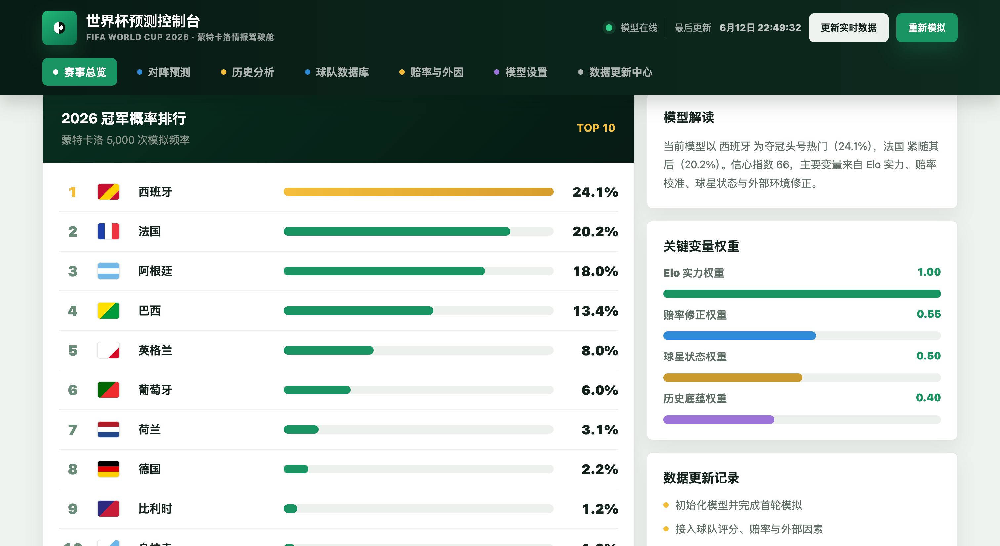

# World Cup Elo Forecast

一个轻量级 2026 世界杯赛前数据工具：基于各队 Elo 实力评分、近期状态和赛前变量，展示每日赛程、球队资料和基础倾向。

线上体验：[worldcup.renrenrenai.cn](https://worldcup.renrenrenai.cn/)

> 公开版展示每日比赛、球队近期状态、历史交锋、赛前变量和实时更新入口。数据用于娱乐和研究参考，不构成任何收益、投资或财务建议。



## 今日免费赛程

更新时间：2026-06-12

| 开球时间 | 北京时间 | 赛事 | 场馆 | 状态 |
|---|---|---|---|---|
| 06/12 15:00 ET | 06/13 03:00 北京 | 加拿大 vs 波黑 | BMO Field, Toronto | 待开赛 |
| 06/12 21:00 ET | 06/13 09:00 北京 | 美国 vs 巴拉圭 | SoFi Stadium, Los Angeles | 待开赛 |

> 免费公开内容只展示赛程、双方基础信息、近期状态、历史交锋和简单倾向；具体比分预测、胜平负概率、爆冷指数、模型信心值和一句话结论属于解锁内容，不进入 GitHub 公开版。

## 功能

- 任意两队 Elo 对阵基础倾向
- 48 队、12 个小组的可编辑起始数据
- 小组赛 + 32 强淘汰赛蒙特卡洛模拟
- 2022 世界杯后俱乐部大赛和球星状态修正模型
- 各大国家核心球星池、球星指数和走势标签
- 国家队、俱乐部和位置名称中文显示层
- 国际政策 / 外部环境修正和市场热度校准
- 纯 Elo、状态、政策、市场四阶段预测走势分析
- 2026 小组赛 72 场逐场基础资料和赛前变量
- 2002-2022 完赛世界杯历史趋势和 2026 当前赛制概览
- 可调模拟次数、主场加成、平局倾向、随机种子
- 浏览器本地运行，无构建步骤、无后端依赖

## 使用

直接打开 `index.html`，或用任意静态服务器托管本目录。

```bash
python3 -m http.server 8000
```

然后访问 `http://localhost:8000`。

## 数据说明

内置球队、分组和 Elo 是便于演示的起始数据，不是实时评级。页面里的评分可以直接编辑；如果你有最新 Elo 或自定义实力评分，把对应数值改掉后重新模拟即可。

历史分析区使用 2002-2022 完赛届的冠军、决赛、总进球和赛制摘要；2026 因仍在进行中，只作为当前赛制和时间线信息展示，不参与历史冠军趋势统计。

俱乐部 / 球星状态模型使用 2022 世界杯后的关键俱乐部赛事节点和代表性球星样本，为国家队生成临时 Elo 修正。这个修正默认启用，但只影响页面里的预测计算，不会覆盖球队基础 Elo。

各大国家球星数据使用重点国家的核心球员池样本，展示球员俱乐部、位置、状态分、国家队影响、可用性和走势标签。它不是最终参赛名单。

页面显示使用中文球队和俱乐部名称；底层模型仍保留英文 key，避免 Elo、状态、政策和市场模型之间的匹配失效。

国际政策 / 市场热度校准使用东道主组织适应、区域旅行、扩军赛制、行政不确定性和外部热度快照生成小幅 Elo 修正。市场数据会随来源和时间变化；本工具不提供结果承诺或收益建议。

逐场比赛资料覆盖 12 个小组的 72 场小组赛。GitHub 公开版只展示基础信息、状态、历史和简单倾向；具体比分、胜平负概率、爆冷指数和模型信心值属于解锁内容。

预测走势分析比较四个模型阶段：纯 Elo、加入俱乐部/球星状态、加入政策/外部环境、加入市场热度校准。它展示的是模型层变化带来的概率走势，不是实时比分曲线。

## 模型说明

- 单场基础胜率使用 Elo 公式：`1 / (1 + 10 ^ ((eloB - eloA) / 400))`
- 小组赛包含平局概率，并用积分、净胜球、进球数排序
- 淘汰赛不允许平局，直接按 Elo 概率抽样晋级队
- 32 强对阵采用一个稳定的简化种子规则：12 个小组第一、12 个小组第二、8 个最佳第三名按强弱交错进入 bracket
- 俱乐部 / 球星修正由俱乐部大赛权重、球星状态、角色影响和可用性聚合为国家队 Elo boost
- 国家球星池用状态、影响力和可用性生成球星指数，用于解释国家队上限和风险
- 政策 / 市场修正由外部环境因子和公开热度快照聚合为可开关的 Elo boost
- 每场比赛图复用当前选中的 Elo、状态、政策和市场修正层，因此开关变化会同步改变逐场概率
- 走势分析固定比较四个模型阶段，用于解释模型层如何推高或压低夺冠概率

这不是收益模型，也不会完整覆盖伤病、赛程旅行、阵容、天气、红牌等上下文因素。它的目标是给出一个透明、可调、好理解的概率沙盘。
